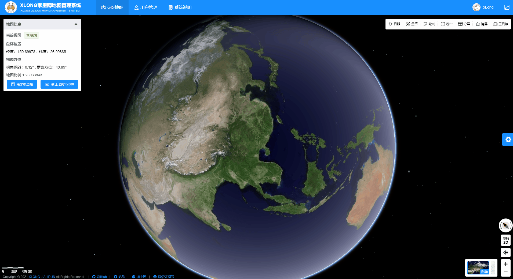
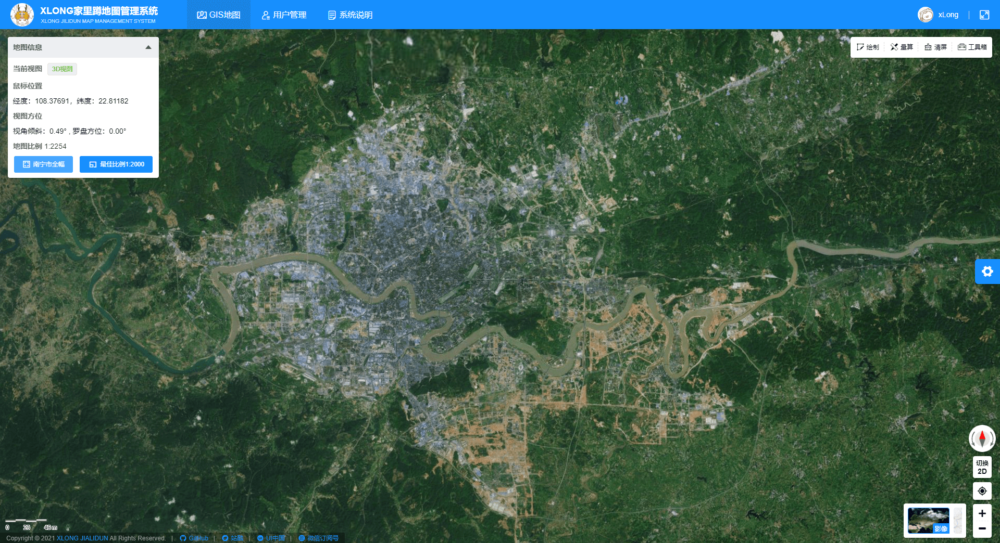
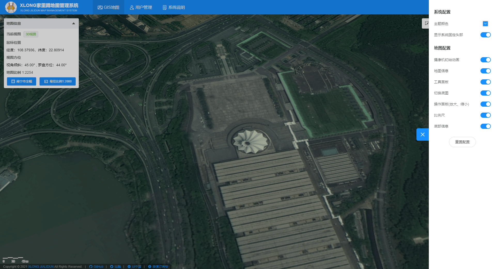
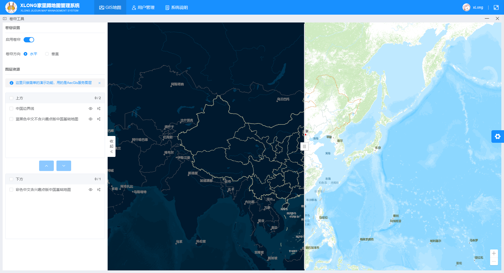
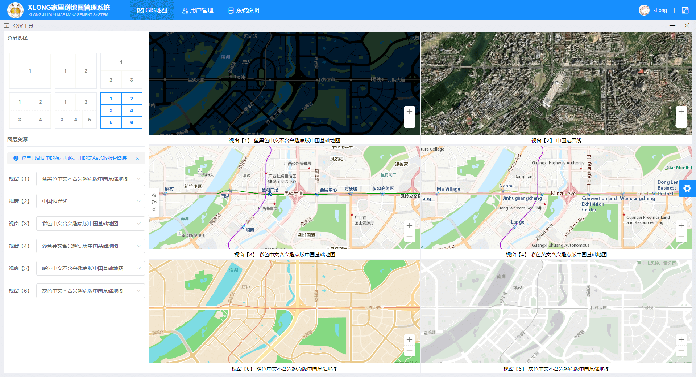
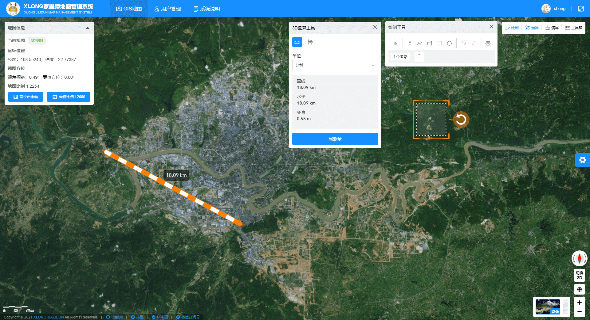
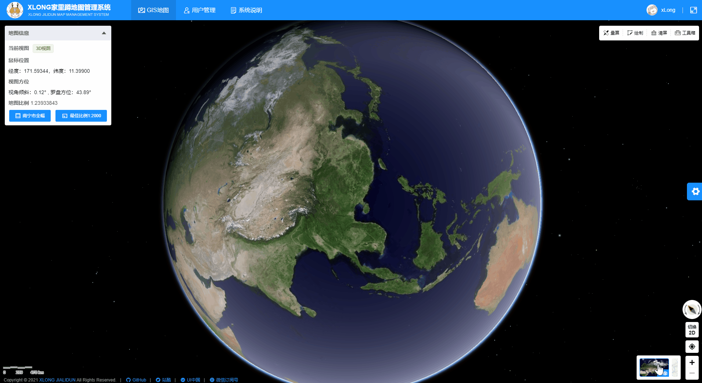
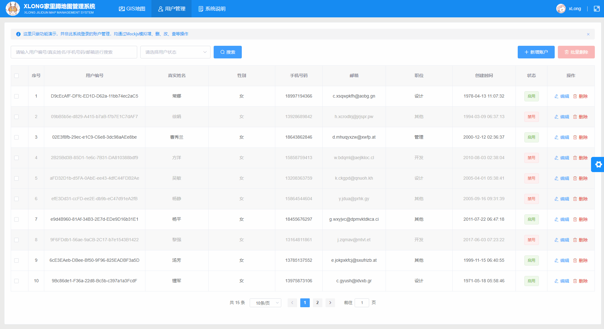
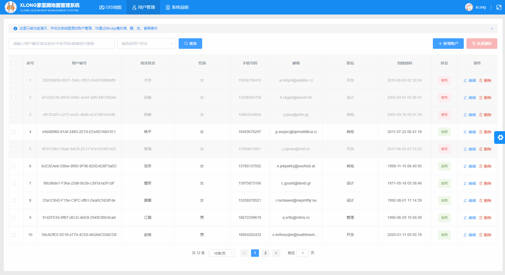

# xlong-map-admin

## 重要通知！！！ 
我的账号在Github开启2FA设置后，因某种原因丢失恢复码导致账号无法登录，日后该账号下的所有项目在github不再更新，若想查看持续更新的项目请移步到 [我的码云仓库](https://gitee.com/xlong1029)

## 介绍

xlong-map-admin是一套基于 Vite + Vue3 + Element Plus + ArcGis 开发的单页面客户端渲染的地图管理系统示例。  

GIS功能包含：量算、绘制、分屏、卷帘、定位、切换底图、自定义工具栏和放大缩小等基本操作。  

系统配置功能包含：定制系统主题、头部、是否启用keepAlive和地图的控件配置。  

温馨提示：
1. 使用Mock.js随机生成数据，拦截 Ajax 请求
2. 项目启动成功后需要等待一段时间加载资源
3. 定位功能，按ArcGis官方示例，获取当前定位总是定位到兰州附近
3. Bmob版传送门：[develop-vite-bmob](https://github.com/xLong1029/xlong-map-admin/tree/develop-vite-bmob)（使用Bmob本地运行正常，打包发布后会报错，猜测是与Vite不兼容）

* 该项目仅作学习参考，请勿商用

## 项目展示

> DEMO地址：https://xlong1029.github.io/xlong-map-admin/

## 更新说明

1. 2023-03-30  
新增书签工具

## 项目说明

#### 1. 前后端分离开发模式

- **前端**：Vite + Vue3
- **后端**：Mock.js模拟请求

#### 2. 项目用到技术、框架与插件

[Vue3](https://v3.vuejs.org/)<br/>
[Vite](https://cn.vitejs.dev/)<br/>
[Mockjs](http://mockjs.com/)<br/>
[Element Plus](https://github.com/element-plus)<br/>
[ArcGis](https://developers.arcgis.com/javascript/latest)<br/>

#### 3. 角色权限说明

1. 超级管理员  
可见所有菜单，可对用户进行增、删、改、查等管理。  
测试账户：18376686974，密码：123456
2. 普通管理员  
可见所有菜单，只能查看用户信息，无法对用户进行增、删、改管理。  
测试账户：17777075292，密码：123456
3. 普通用户  
仅可见“GIS地图”和“系统说明”菜单。  
测试账户：18888888888，密码：666666

## 部分项目运行截图

gif文件稍微有点大，被压缩了，丢失了部分色彩：

* 登录界面


* 个人资料



* GIS地图



* GIS地图-切换底图


* GIS地图-地图配置



* GIS地图-卷帘



* GIS地图-分屏



* GIS地图-量算、绘制



* GIS地图-自定义工具栏



<!-- * GIS地图-旋转、切换视图

 -->

* 用户管理-搜索



* 用户管理-新增、编辑


* 用户管理-删除



## 目录结构

```
│  .env.development // 开发环境配置
│  .env.production // 生产环境配置
│  .env.release // release环境配置
│  .gitignore
│  package.json
│  vite.config.js // 配置文件
│  README.md
│  index.html // 入口文件
│
├─pubilc
│   favicon.ico // 图标
│
├─src
│  │  main.js // 项目入口js
│  │  permission.js // 路由权限配置
│  │  settings.js // 设置文件
│  │  App.vue // 根组件
│  │
│  ├─assets // 资源目录，这里的资源会被wabpack构建
│  ├─api // api接口文件
│  ├─store  // 应用级数据（state）
│  ├─styles  // 样式
│  │
│  ├─mock // 模拟请求数据
│  │  │  index.js
│  │  │  mock-handle.js // 数据处理
│  │  │  mock-server.js // 正式环境使用配置
│  │  │
│  │  └─modules
│  │
│  ├─common 通用方法
│  │  │ index.js
│  │  │ filter.js
│  │  │ form.js
│  │  │ table.js
│  │  │ theme.js
│  │  │ utilsPanel.js
│  │  │ maxScreenPanel.js
│  │  │
│  │  ├─map // 地图相关
│  │  └─mapEvents // 地图事件
│  │
│  ├─config // 项目配置
│  │    index.js
│  │
│  ├─components // 功能组件
│  │
│  ├─layout // 布局
│  │  │
│  │  │
│  │  ├─ default // 基础布局
│  │  │   │  index.vue
│  │  │   │
│  │  │   └─components // 布局组件
│  │  │      │  index.js
│  │  │      │
│  │  │      ├─Header // 顶部
│  │  │      ├─Main // 主页面
│  │  │      └─Settings // 设置
│  │  │
│  │  ├─fullscreen // 全屏布局
│  │  │
│  │  └─router-view // N页面路由视图
│  │
│  ├─views // 视图
│  │  │
│  │  ├─account-manage // 用户管理
│  │  ├─describe // 系统说明
│  │  ├─error-page // 错误页面
│  │  ├─login // 登录
│  │  ├─redirect // 重定向
│  │  └─map // 地图
│  │
│  ├─utils // 通用工具函数
│  │    index.js
│  │    auth.js // 读写token
│  │    map.js // 地图通用工具
│  │    request.js // 请求配置
│  │    scroll-to.js // 页面滚动
│  │    validate.js // 验证
│  │
│  └─router  // 路由配置
│     │  index.js
│     │
│     └─modules // 分模块的动态路由
│
└─static // 静态资源
```

## 本地运行
1. 安装依赖
> npm install
2. 运行项目
> npm run dev
3. 访问地址：http://localhost:6006

* 通过IP地址访问，获取当前定位时会提示“定位失败，用户拒绝请求地理定位”，通过http://localhost:6006/ 访问可正常使用定位功能。定位功能，ArcGis官方示例，获取当前定位总是定位到兰州附近

## 作者联系方式

QQ：381612175
TEL: 18376686974

github：https://github.com/xLong1029/

站酷主页：http://xlong.zcool.com.cn/

UI 中国：http://i.ui.cn/ucenter/358591.html

- 此项目做学习 Vue3 + Vite 测试使用，ArcGis 我只是外行